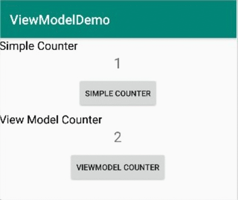

Used ViewModel with Live Data.

# Purpose of ViewModel : 

1) When configuration changes(Screen orientation change) then the activity is destroyed and recreated , at this time values are reset.
2) For manage this before viewmodel we used **"onSaveInstanceState()"** for store values and using **"onRestoreInstanceState()"** can retrive stored values , but it have some disadvantages like : 

   -> **"onSaveInstanceState()"** we can store only the small amount of data.
   
   -> Data needs to be Parcelable, so it’s not so easy to set and restore values.
   
so it's better to store some small amount of data with **"onSaveInstanceState()"** like user_id so that after recreate we can retrive data using it. and store large amount of Custom model list with ViewModel.

So if Activity killed then we can get user_id by **"onSaveInstanceState()"** and retrive data and manage configuration changes using ViewModel without retrive data again and again. 

# Purpose of Live Data :
-> It use observer pattern.

-> Here we used liveData , we observer counter value. So whenever changes is done in counter , then it notify to Activity about changes.

Here is simple example when orientation change value of counter is reset but value of ViewModel counter is as it is , and used livedata to observ counter value. :

